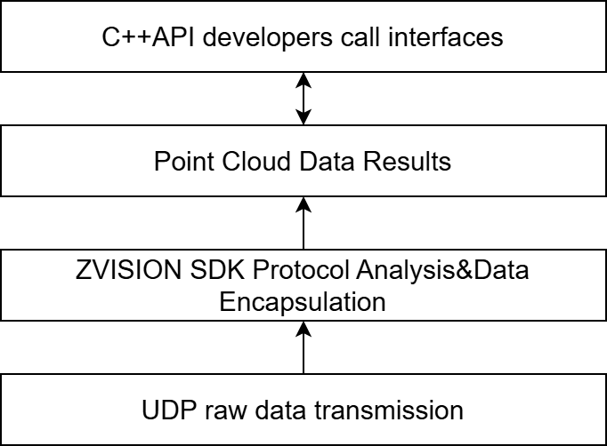
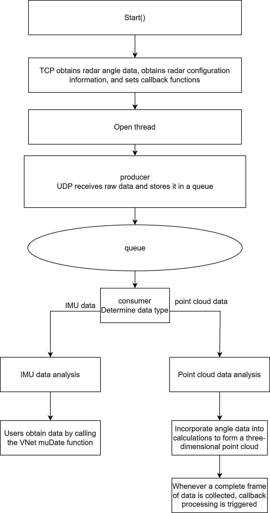

# ZVISION SDK

## Table of Contents

- [Overview](#Overview)
- [SDK Architecture](#SDK Architecture)
- [SDK Workflow](#SDK Workflow)
- [Supported Operating Systems](#Supported Operating Systems)
- [Dependencies and Build](#Dependencies and Build)
    - [Install Dependencies](#Install Dependencies)
    - [Build on Ubuntu](#Build on Ubuntu)
    - [Build on Windows](#Build on Windows)
- [Online Mode](#Online Mode)
- [MRZ16 Serial Mode](#MRZ16 Serial Mode)
    - [Serial Connection and Run](#Serial Connection and Run)
    - [Channel Angle File (CSV)](#Channel Angle File (CSV))
    - [Frame Format](#Frame Format)
    - [Whole-Revolution Output and Cloud Structure](#Whole-Revolution Output and Cloud Structure)
    - [Coordinate Conversion](#Coordinate Conversion)
- [Sample Programs](#Sample Programs)

------

## Overview

The **ZVISION SDK** provides **LiDAR point cloud acquisition, protocol parsing, TCP configuration, and visualization tools**.
 Supported device models: `EZ6_B2`, `NZ Series`, `MRZ16` (serial).

Main features:

- UDP communication for receiving raw data (`EZ6_B2` / `NZ Series`)
- Serial communication for the MRZ16 raw stream (dual UART, `EE FF` protocol)
- Protocol parsing and data encapsulation
- Point cloud generation and visualization
- C++ API for application integration

------

## SDK Architecture

The ZVISION SDK provides point cloud data transmission, visualization demos, and C++ APIs:



The UDP protocol is used for communication between the SDK and LiDAR sensors, handling raw data transmission. The SDK parses and encapsulates the raw data into point clouds. Users can access point cloud results via APIs, and the SDK also provides visualization tools for intuitive analysis.

------

## SDK Workflow

`EZ` series devices do not provide IMU data, while `NZ` series devices allow IMU configuration via GUI.



------

## Supported Operating Systems

**Ubuntu**

| OS           | PCL    | VTK   |
| ------------ | ------ | ----- |
| Ubuntu 22.04 | 1.14.0 | 9.1.0 |
| Ubuntu 20.04 | 1.10.0 | 7.1.1 |

⚠️ Note: Ubuntu 22.04 ships with PCL 1.12.1 by default, which is incompatible with VTK. Please upgrade PCL.

**Windows**

| OS    | Visual Studio | PCL    | CMake  |
| ----- | ------------- | ------ | ------ |
| Win10 | VS2019        | 1.12.1 | 3.26.4 |

------

## Dependencies and Build

### Install Dependencies (Ubuntu)

```shell
sudo apt-get update
sudo apt-get install cmake
sudo apt-get install g++
sudo apt-get install libpcap-dev libeigen3-dev libboost-dev libpcl-dev
```

### Build on Ubuntu

```shell
1. mkdir build
2. cd build
3. cmake ../
4. make -j4
```

### Build on Windows

```shell
Method 1:
1. mkdir build
2. cd build
3. cmake ../
4. Open the build folder with VS2019, load the .sln file, select the project, and build.

Method 2:
1. mkdir build
2. cd build
3. cmake ../
4. cmake --build . --config Release
```

------

⚠️ Note: 

1.After compiling on the Windows system, it is necessary to copy the 'OpenNI2. dll' file to the 'build \ sample \ pointcloud' directory.
2.If the file cannot be found, you can search for 'OpenNI2. dll' in the Windows system and copy it to the above directory.

## Online Mode

Online mode is used for real-time LiDAR data acquisition and point cloud visualization.
 ZVISION LiDAR can connect directly to a PC with the following default network parameters:

| Parameter   | Default Value  |
| ----------- | -------------- |
| IP Address  | 192.168.10.108 |
| Port        | 2368           |
| Subnet Mask | 255.255.255.0  |
| Gateway     | 192.168.10.1   |

Run online mode:

```bash
./sample/pointcloud/pointcloud_demo -online -ip 192.168.10.108 -p 2368 -nz1_a2
```

- `EZ` series: no IMU data
- `NZ` series: IMU can be configured via GUI

Retrieve LiDAR configuration:

```shell
./sample/lidar_config/lidar_config nz1_a2 -get_basic_info 192.168.10.108
```

------

## MRZ16 Serial Mode

The MRZ16 does not use UDP. It talks over **two UARTs**; the point-cloud port carries a continuous `EE FF` byte stream.

### Serial Connection and Run

| Port | Purpose | Default device | Default baud |
| --- | --- | --- | --- |
| Command (cmd) | Send `$LDCMD` / receive `$LDACK`, used to read the per-channel angles | /dev/ttyACM2 | 9600 |
| Data (data) | Receive point-cloud frames and IMU frames | /dev/ttyACM0 | 3125000 |

```bash
./sample/pointcloud/pointcloud_demo -mrz16 -cmd /dev/ttyACM2 -data /dev/ttyACM0 -c channel_angles.csv
```

| Option | Description | Default |
| --- | --- | --- |
| `-mrz16` | Required, enables the MRZ16 serial mode | - |
| `-cmd` | Command serial device | /dev/ttyACM2 |
| `-data` | Point cloud serial device | /dev/ttyACM0 |
| `-c` | Channel angle file (CSV); when absent or broken the angles are fetched via `$LDCMD` | empty |
| `-baud_cmd` | Command port baud rate | 9600 |
| `-baud_data` | Point cloud port baud rate | 3125000 |
| `-imu` | Optional, enable IMU output | off |

⚠️ Note: 3125000 is a custom baud rate; the USB-serial chip and its driver must support it.

### Channel Angle File (CSV)

The horizontal / vertical angle of every channel is required by the coordinate conversion and can be supplied with `-c`.

Format:

- Extension must be `.csv`
- One channel per line: `<horizontal_deg>,<vertical_deg>`, in degrees
- **No channel-number column**; line i (zero-based) is channel i
- At most 16 lines (one per channel)
- Blank lines and lines starting with `#` are ignored

Example:

```
# horizontal_deg,vertical_deg   (row index = channel number)
-1.20,3.60
-1.00,2.40
-0.80,1.20
...
```

Without `-c`, the SDK sends `$LDCMD` (cmd_id `0x0E`) on the command port and reads the angles from `$LDACK`: 8 bytes per channel, int32 horizontal + int32 vertical (little endian, unit 0.01 deg).

### Frame Format

The data port is a continuous byte stream; the SDK slices frames on the `EE FF` header:

| Frame | data_type | Length | Content |
| --- | --- | --- | --- |
| Point cloud | 0x00 | 80 bytes | header + UTC time + azimuth + 16 channels (distance / reflectivity) + window contamination + state + `udp_sequence` + CRC |
| IMU | 0x01 | 34 bytes | header + UTC time + acc / gyro axes + sequence + CRC |

Raw value scales:

| Field | Scale |
| --- | --- |
| `distance` | × 0.004 m |
| `azimuth` | × 0.01 deg |

**One point-cloud frame = one azimuth column**: the 16 channels fire together and share the frame azimuth. The lidar is a rotating-head design with **600 columns per revolution** (0.6 deg / column).

### Whole-Revolution Output and Cloud Structure

The serial stream has no "whole frame" boundary, so the SDK splits revolutions on the azimuth wrap: a revolution ends when the previous column was ≥ 300 deg and the current one is < 60 deg.

- The frame that triggers the wrap is the **first column of the new revolution** and is re-processed into it
- Metadata is filled and the cloud is delivered (callback / `GetPointCloud`) only when the revolution completes
- If the lidar stops mid-scan, the partial revolution is not emitted (no idle flush)

| Field | Meaning |
| --- | --- |
| `row` | Channel number (0..15) |
| `col` | Column index, derived from the frame `udp_sequence` relative to the first frame of the revolution; a dropped packet leaves a gap instead of shifting the following columns |
| `rowCnt` | 16 |
| `colCnt` | 600, fixed; it never changes with the number of received columns, a lost column simply has no point |
| `pointid` / `idx` | Index of the point inside the revolution (0..N-1) |

### Coordinate Conversion

```
dl = sqrt(7.00^2 + 13.86^2) = 15.53 mm   eccentricity radius of the optical center
dtheta = atan(7.00 / 13.86) = 26.79 deg   optical center angle relative to Y at revolution zero
dh = 5.04 mm                             height of the optical center above the origin

Px = d*cos(phi)*sin(theta+theta') + dl*sin(theta+theta'+dtheta)
Py = d*cos(phi)*cos(theta+theta') + dl*cos(theta+theta'+dtheta)
Pz = d*sin(phi) + dh
```

- `d`: channel distance (slant range, measured from the optical center)
- `theta`: azimuth of the current frame
- `theta'`: channel horizontal angle (angle file or `$LDACK`)
- `phi`: channel vertical angle
- Coordinate system: theta = 0 points to +Y, theta grows towards +X, z is up
- The optical center rotates with the head, hence the offset term depends on theta (`dl` term contains theta)

Related source files:

- `sdk/src/packet_mrz16.cpp`
- `sdk/include/protocol/packet_mrz16.h`
- `sample/pointcloud/pointcloud_demo.cpp`

------

## Sample Programs

The following sample programs demonstrate typical SDK usage:

- Point cloud acquisition and visualization:
     `lidar_sdk/sample/pointcloud/pointcloud_demo.cpp`
- LiDAR configuration and information retrieval:
     `lidar_sdk/sample/lidar_config/lidar_config_demo.cpp`
- MRZ16 serial acquisition (`-mrz16`):
     `lidar_sdk/sample/pointcloud/pointcloud_demo.cpp`

