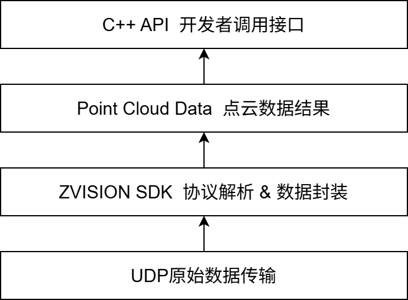
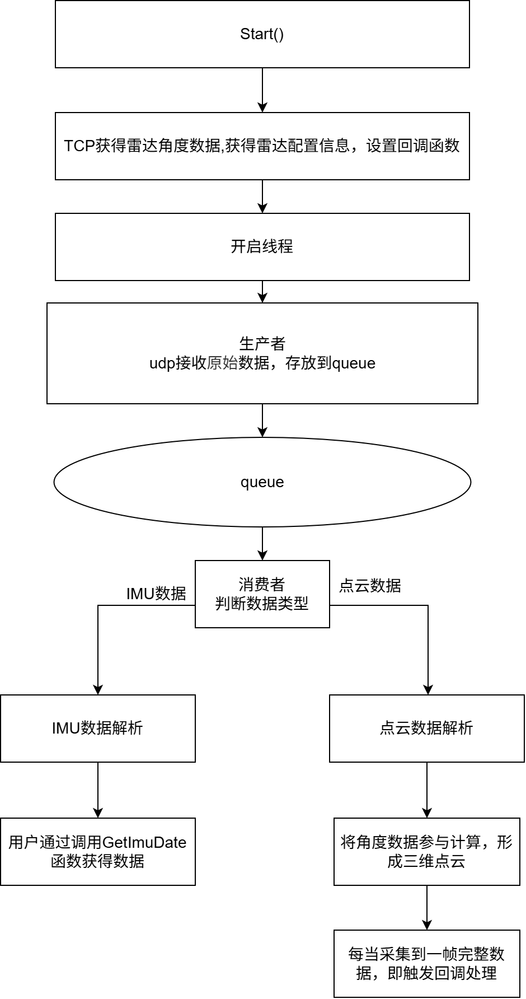

# ZVISION SDK

## 目录
- [概述](#概述)
- [SDK 架构说明](#sdk-架构说明)
- [SDK 运行流程](#sdk-运行流程)
- [支持的操作系统](#支持的操作系统)
- [依赖与编译](#依赖与编译)
  - [安装依赖](#安装依赖)
  - [编译-ubuntu](#编译-ubuntu)
  - [编译-windows](#编译-windows)
- [在线模式](#在线模式)
- [MRZ16 串口模式](#mrz16-串口模式)
  - [串口连接与运行](#串口连接与运行)
  - [通道角度文件 CSV](#通道角度文件-csv)
  - [数据帧格式](#数据帧格式)
  - [整圈输出与点云结构](#整圈输出与点云结构)
  - [坐标解算](#坐标解算)
- [示例程序参考](#示例程序参考)

## 概述

ZVISION_SDK 提供了 **LiDAR 点云采集、协议解析、TCP 配置与可视化工具**。
 支持的设备型号：`EZ6_B2`、`NZ系列`、`MRZ16`（串口）。
 主要功能：

- UDP 通信，接收原始数据（`EZ6_B2` / `NZ系列`）
- 串口通信，接收 MRZ16 原始数据流（双 UART，`EE FF` 协议）
- 协议解析与数据封装
- 点云数据生成与可视化
- C++ API 接口调用

## SDK 架构说明

ZVISION SDK提供了点云数据传输和点云可视化demo，以及c++接口：



UDP 协议用于 SDK 与 LiDAR 传感器之间的通信，承担原始数据的传输。ZVISION_SDK 对接收到的原始数据进行协议解析与封装，生成点云数据。用户可通过 API 调用获取点云结果，同时 ZVISION_SDK 还提供可视化工具，便于直观查看与分析。

## SDK 运行流程

`EZ` 系列无 IMU 数据，`NZ` 系列可通过 GUI 配置 IMU。



## 支持的操作系统

`Ubuntu系统`

| OS          | PCL    | VTK   |
| ----------- | ------ | ----- |
| ubuntu22.04 | 1.14.0 | 9.1.0 |
| ubuntu20.04 | 1.10.0 | 7.1.1 |

⚠️ 注意：Ubuntu22.04 默认 PCL 1.12.1 与 VTK 不兼容，请升级 PCL。

`Windows系统`

| OS    | Visual Studio | PCL    | CMAKE  |
| ----- | ------------- | ------ | ------ |
| WIN10 | VS2019        | 1.12.1 | 3.26.4 |

## 依赖与编译

### 安装依赖

```shell
sudo apt-get update
sudo apt-get install cmake
sudo apt-get install g++
sudo apt-get install libpcap-dev libeigen3-dev libboost-dev libpcl-dev
```

### 编译 (Ubuntu)

```shell
1. mkdir build
2. cd build
3. cmake ../
4. make -j4
```

### 编译 (Windows)

```shell
方式一：
1. mkdir build
2. cd build
3. cmake ../
4. 使用VS019打开build文件夹，打开.sln文件，并选择对应的项目并执行生成
方式二：
1. mkdir build
2. cd build
3. cmake ../
4. cmake --build . --config Release
```

⚠️ 注意：
1. 在 Windows 系统编译完成后，需要将 `OpenNI2.dll` 文件复制到 `build\sample\pointcloud` 目录。
2. 如果未找到该文件，可在 Windows 系统中搜索 `OpenNI2.dll` 并复制到上述目录。

## 在线模式

在线模式用于实时接收 LiDAR 数据并进行点云可视化。ZVISION LiDAR 可以直接连接 PC，默认网络参数如下：

| 参数     | 默认值         |
| -------- | -------------- |
| IP 地址  | 192.168.10.108 |
| 端口     | 2368           |
| 子网掩码 | 255.255.255.0  |
| 网关     | 192.168.10.1   |

运行在线模式：

```bash
./sample/pointcloud/pointcloud_demo -online -ip 192.168.10.108 -p 2368 -nz1_a2
```

`EZ` 系列无 IMU 数据，`NZ` 系列可通过 GUI 配置 IMU。

得到雷达的配置信息:

```shell
./sample/lidar_config/lidar_config nz1_a2 -get_basic_info 192.168.10.108
```

## MRZ16 串口模式

MRZ16 不使用 UDP，而是通过**两路串口**与主机通信，数据口输出连续的 `EE FF` 字节流。

### 串口连接与运行

| 串口 | 作用 | 默认设备 | 默认波特率 |
| --- | --- | --- | --- |
| 命令口（cmd） | 发送 `$LDCMD`、接收 `$LDACK`，用于读取每通道角度 | /dev/ttyACM2 | 9600 |
| 数据口（data） | 接收点云帧与 IMU 帧 | /dev/ttyACM0 | 3125000 |

```bash
./sample/pointcloud/pointcloud_demo -mrz16 -cmd /dev/ttyACM2 -data /dev/ttyACM0 -c channel_angles.csv
```

| 参数 | 说明 | 默认值 |
| --- | --- | --- |
| `-mrz16` | 必选，启用 MRZ16 串口模式 | - |
| `-cmd` | 命令口设备 | /dev/ttyACM2 |
| `-data` | 数据口设备 | /dev/ttyACM0 |
| `-c` | 通道角度文件（CSV）；缺省或加载失败时通过 `$LDCMD` 自动读取 | 空 |
| `-baud_cmd` | 命令口波特率 | 9600 |
| `-baud_data` | 数据口波特率 | 3125000 |
| `-imu` | 可选，输出 IMU 数据 | 关闭 |

⚠️ 注意：数据口波特率 3125000 为自定义波特率，需要 USB 转串口芯片与驱动支持。

### 通道角度文件（CSV）

每通道的水平角 / 垂直角参与坐标解算，可用 `-c` 指定 CSV 文件提供。

格式要求：

- 扩展名必须为 `.csv`
- 每行一个通道：`<horizontal_deg>,<vertical_deg>`，单位为度
- **不含通道号列**，第 i 行（0 基）即通道 i
- 最多 16 行（与通道数一致）
- 空行与以 `#` 开头的行被忽略

示例：

```
# horizontal_deg,vertical_deg   (row index = channel number)
-1.20,3.60
-1.00,2.40
-0.80,1.20
...
```

未指定 `-c` 时，SDK 通过命令口发送 `$LDCMD`（cmd_id `0x0E`）读取通道角度，应答 `$LDACK` 中每通道 8 字节：int32 水平角 + int32 垂直角（小端，单位 0.01°）。

### 数据帧格式

数据口为连续字节流，SDK 按 `EE FF` 帧头切分：

| 帧类型 | data_type | 长度 | 内容 |
| --- | --- | --- | --- |
| 点云帧 | 0x00 | 80 字节 | 帧头 + UTC 时间 + 方位角 + 16 通道（距离 / 反射率）+ 窗口污染 + 状态 + `udp_sequence` + CRC |
| IMU 帧 | 0x01 | 34 字节 | 帧头 + UTC 时间 + acc / gyro 三轴 + 序号 + CRC |

原始值缩放：

| 字段 | 缩放 |
| --- | --- |
| `distance` | × 0.004 m |
| `azimuth` | × 0.01 ° |

**一个点云帧 = 一个方位列**：16 个通道同时测距并共用该帧的方位角。雷达为转台式，一圈固定 **600 列**（0.6° / 列）。

### 整圈输出与点云结构

串口流没有"整帧"边界，SDK 用方位角回绕切分整圈：当上一列方位角 ≥ 300° 且当前列 < 60° 时，判定一圈结束。

- 触发回绕的那一列属于**新一圈的第一列**，会被重新处理进新圈
- 整圈结束时才补齐元数据，然后一次性交付（回调 / `GetPointCloud`）
- 雷达中途停转时，最后不足一圈的数据不会自动输出（无空闲补帧）

| 字段 | 含义 |
| --- | --- |
| `row` | 通道号（0..15） |
| `col` | 列号，由帧内 `udp_sequence` 相对本圈首帧序号计算；丢包时列号留空档，后续列不会整体错位 |
| `rowCnt` | 16 |
| `colCnt` | 600，固定值，不随实际收到的列数变化；丢失的列只是没有点 |
| `pointid` / `idx` | 点在本圈中的序号（0..N-1） |

### 坐标解算

```
δl = √(7.00² + 13.86²) = 15.53 mm    光心到旋转轴的偏心半径
δθ = atan(7.00 / 13.86) = 26.79°      光心在本体零位下相对 Y 轴的偏角
δh = 5.04 mm                          光心相对原点的高度

Px = d·cosφ·sin(θ+θ') + δl·sin(θ+θ'+δθ)
Py = d·cosφ·cos(θ+θ') + δl·cos(θ+θ'+δθ)
Pz = d·sinφ + δh
```

- `d`：通道距离（斜距，从光心量起）
- `θ`：当前帧方位角
- `θ'`：通道水平角（来自角度文件或 `$LDACK`）
- `φ`：通道垂直角
- 坐标系：θ = 0 指向 +Y，θ 增大转向 +X，z 向上
- 光心随转台一起旋转，因此偏移项随 θ 变化（`δl` 项中含 θ）

相关源码：

- `sdk/src/packet_mrz16.cpp`
- `sdk/include/protocol/packet_mrz16.h`
- `sample/pointcloud/pointcloud_demo.cpp`

## 示例程序参考

以下示例程序展示了 SDK 的典型使用方式：

- 点云采集与可视化： 
  `lidar_sdk/sample/pointcloud/pointcloud_demo.cpp`

- 雷达配置与信息获取： 
  `lidar_sdk/sample/lidar_config/lidar_config_demo.cpp`

- MRZ16 串口采集（`-mrz16`）：
  `lidar_sdk/sample/pointcloud/pointcloud_demo.cpp`
